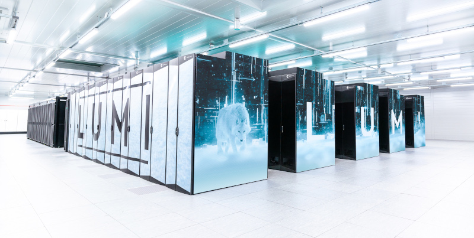

# Peter Larsson's HPC notes

Pages with various notes on high-performance computing (HPC) related topics, especially [AMD GPUs](https://www.amd.com/en/graphics/instinct-server-accelerators) and software for electronic structure calculations and molecular dynamics.

## Opinion disclaimer

The content here are my own opinions and do not represent the views or opinions of LUMI or the KTH Royal Institute of Technology, or any of my future employers.

## About me

HPC application expert at the Parallel Computing Centre at Royal Institute of Technology in Sweden. I work in the LUMI User Support Team, helping scientists make the best out [LUMI](https://www.lumi-supercomputer.eu/), one of the European pre-exascale supercomputers and currently the #3 supercomputer in the world. 

Previously, I worked at Atos in Germany in the HPC division, and at the National Supercomputer Centre in Linköping, Sweden. I have background in computational materials science, so you can find some information about scientific software for density functional theory (DFT) calculations here.

## Contact

You can always reach me at: ypetla@kth.se, but please realize that I may not be able to respond to all requests for help with installing HPC applications due to time contraints.
